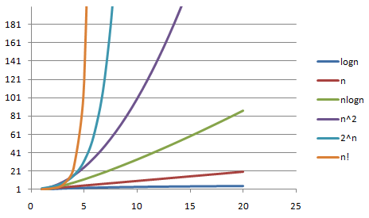

> 面试用，考研复试用，致敬热爱计算机的自己。
>
> 除了基本的解法，还按照要求尽量拓展解法，使用Java语言，深入学习Java。

## 1.[[简单]88. 合并两个有序数组](https://leetcode.cn/problems/merge-sorted-array/)

给你两个按 **非递减顺序** 排列的整数数组 `nums1` 和 `nums2`，另有两个整数 `m` 和 `n` ，分别表示 `nums1` 和 `nums2` 中的元素数目。

请你 **合并** `nums2` 到 `nums1` 中，使合并后的数组同样按 **非递减顺序** 排列。

**注意：**最终，合并后数组不应由函数返回，而是存储在数组 `nums1` 中。为了应对这种情况，`nums1` 的初始长度为 `m + n`，其中前 `m` 个元素表示应合并的元素，后 `n` 个元素为 `0` ，应忽略。`nums2` 的长度为 `n` 。

 

**示例 1：**

```
输入：nums1 = [1,2,3,0,0,0], m = 3, nums2 = [2,5,6], n = 3
输出：[1,2,2,3,5,6]
解释：需要合并 [1,2,3] 和 [2,5,6] 。
合并结果是 [1,2,2,3,5,6] ，其中斜体加粗标注的为 nums1 中的元素。
```

**示例 2：**

```
输入：nums1 = [1], m = 1, nums2 = [], n = 0
输出：[1]
解释：需要合并 [1] 和 [] 。
合并结果是 [1] 。
```

**示例 3：**

```
输入：nums1 = [0], m = 0, nums2 = [1], n = 1
输出：[1]
解释：需要合并的数组是 [] 和 [1] 。
合并结果是 [1] 。
注意，因为 m = 0 ，所以 nums1 中没有元素。nums1 中仅存的 0 仅仅是为了确保合并结果可以顺利存放到 nums1 中。
```

 

**提示：**

- `nums1.length == m + n`
- `nums2.length == n`
- `0 <= m, n <= 200`
- `1 <= m + n <= 200`
- `-109 <= nums1[i], nums2[j] <= 109`

 

**进阶：**你可以设计实现一个时间复杂度为 `O(m + n)` 的算法解决此问题吗？

> 见解法2


**解法1：**

> 先合并两个数组，然后直接快速排序

```java
class Solution {
  public void merge(int[] nums1, int m, int[] nums2, int n) {
    int cnt = 0;
    for (int i = m; i < m + n; i++) {
      nums1[i] = nums2[cnt++];
    }
    Arrays.sort(nums1);
  }
}
```

> 暴力解法
>
> Arrays.sort();


**解法2：**

> 新开一个数组，牺牲时间换空间。

```java
class Solution {
  public void merge(int[] nums1, int m, int[] nums2, int n) {
    int[] nums3=new int[m+n];
    int left=0;int right=0;
    for(int i=0;i<m+n;i++){
      if(left==m){
        nums3[i]=nums2[right++];
      }else if(right==n){
        nums3[i]=nums1[left++];
      }else if(nums1[left]<nums2[right]){
        nums3[i]=nums1[left++];
      }else{
        nums3[i]=nums2[right++];
      }
    }
    for(int i=0;i<m+n;i++){
      nums1[i]=nums3[i];
    }
    // System.arraycopy(nums3, 0, nums1, 0, m + n);
  }
} 
```

> 显然写的比较繁琐。

> if(right==n || nums1[left]<=nums2[right])
>
> 这样写会出错，会数组越界


**解法3：**

> 逆向思维

```java
class Solution {
  public void merge(int[] nums1, int m, int[] nums2, int n) {
    int i = m - 1;
    int j = n - 1;
    int k = m + n - 1;
    while (i >= 0 && j >= 0) {
      if (nums1[i] < nums2[j])
        nums1[k--] = nums2[j--];
      else
        nums1[k--] = nums1[i--];
    }
    while(j>=0) nums1[k--]=nums2[j--];
  }
}
```

> 逆向填补，然后把nums2剩下的填补


**补充：**

`Arrays.copyOfRange(nums3, 0, m + n)` 和 `System.arraycopy(nums3, 0, nums1, 0, m + n)` 都是用来复制数组的方法，但它们有一些区别：

1. **返回类型**:
   - `Arrays.copyOfRange(nums3, 0, m + n)` 返回一个新的数组。
   - `System.arraycopy(nums3, 0, nums1, 0, m + n)` 是一个 void 方法，它将元素复制到已经存在的数组 `nums1`中。
2. **数组初始化**:
   - `Arrays.copyOfRange(nums3, 0, m + n)` 会创建一个新的数组并返回。
   - `System.arraycopy(nums3, 0, nums1, 0, m + n)` 需要目标数组 `nums1`已经被初始化。
3. **使用场景**:
   - 如果你需要一个新的数组，可以使用 `Arrays.copyOfRange`。
   - 如果你需要将元素复制到一个已经存在的数组中，可以使用 `System.arraycopy`。


## 2.[[简单]27. 移除元素](https://leetcode.cn/problems/remove-element/)

给你一个数组 `nums` 和一个值 `val`，你需要 **[原地](https://baike.baidu.com/item/原地算法)** 移除所有数值等于 `val` 的元素。元素的顺序可能发生改变。然后返回 `nums` 中与 `val` 不同的元素的数量。

假设 `nums` 中不等于 `val` 的元素数量为 `k`，要通过此题，您需要执行以下操作：

- 更改 `nums` 数组，使 `nums` 的前 `k` 个元素包含不等于 `val` 的元素。`nums` 的其余元素和 `nums` 的大小并不重要。
- 返回 `k`。

**用户评测：**

评测机将使用以下代码测试您的解决方案：

```
int[] nums = [...]; // 输入数组
int val = ...; // 要移除的值
int[] expectedNums = [...]; // 长度正确的预期答案。
                            // 它以不等于 val 的值排序。

int k = removeElement(nums, val); // 调用你的实现

assert k == expectedNums.length;
sort(nums, 0, k); // 排序 nums 的前 k 个元素
for (int i = 0; i < actualLength; i++) {
    assert nums[i] == expectedNums[i];
}
```

如果所有的断言都通过，你的解决方案将会 **通过**。

 

**示例 1：**

```
输入：nums = [3,2,2,3], val = 3
输出：2, nums = [2,2,_,_]
解释：你的函数函数应该返回 k = 2, 并且 nums 中的前两个元素均为 2。
你在返回的 k 个元素之外留下了什么并不重要（因此它们并不计入评测）。
```

**示例 2：**

```
输入：nums = [0,1,2,2,3,0,4,2], val = 2
输出：5, nums = [0,1,4,0,3,_,_,_]
解释：你的函数应该返回 k = 5，并且 nums 中的前五个元素为 0,0,1,3,4。
注意这五个元素可以任意顺序返回。
你在返回的 k 个元素之外留下了什么并不重要（因此它们并不计入评测）。
```

 

**提示：**

- `0 <= nums.length <= 100`
- `0 <= nums[i] <= 50`
- `0 <= val <= 100`


**解法1：**

> 枚举，基于不在意后面存储了什么元素。
>
> *O*(*N*)

```java
class Solution {
  public int removeElement(int[] nums, int val) {
      int k=0;
      for(int i=0;i<nums.length;i++){
          if(nums[i]!=val){
              nums[k]=nums[i];
              k++;
          }
      }
      return k;
  }
}
```

> k++确保了k的数值代表了数组nums的长度
>
> 不必在乎剩下的数组里面存储了什么


**解法2：**

> 双指针，参考提示得出灵感。
>
> *O*(*N*)

```java
class Solution {
  public int removeElement(int[] nums, int val) {
    if (nums.length == 0)
      return 0;
    int k = nums.length;
    int l = 0, r = nums.length - 1;
    while (nums[r] == val && r >= 0) {
      r--;
      k--;
      if (k == 0)
        return 0;
    }
    while (l <= r) {
      if (nums[l] == val) {
        nums[l] = nums[r];
        nums[r] = val;
        r--;
        k--;
      }
      l++;
      while (nums[r] == val && r >= 0) {
        r--;
        k--;
        if (k == 0)
          return 0;
      }
    }
    return k;
  }
}
```

> 总是右指针匹配了就把移动右指针，把长度减少。
>
> 基于左右交换的双指针。


**题解：**

> 主要是自己的双指针写的过于繁琐

```java
class Solution {
    public int removeElement(int[] nums, int val) {
        int n = nums.length;
        int left = 0;
        for (int right = 0; right < n; right++) {
            if (nums[right] != val) {
                nums[left] = nums[right];
                left++;
            }
        }
        return left;
    }
}
```

> 基于快慢指针的双指针。
>
> 其实这里和我的解法1一致，不过我的解法1显然比题解还要好。


## 3.[[简单]26. 删除有序数组中的重复项](https://leetcode.cn/problems/remove-duplicates-from-sorted-array/)

给你一个 **非严格递增排列** 的数组 `nums` ，请你**[ 原地](http://baike.baidu.com/item/原地算法)** 删除重复出现的元素，使每个元素 **只出现一次** ，返回删除后数组的新长度。元素的 **相对顺序** 应该保持 **一致** 。然后返回 `nums` 中唯一元素的个数。

考虑 `nums` 的唯一元素的数量为 `k` ，你需要做以下事情确保你的题解可以被通过：

- 更改数组 `nums` ，使 `nums` 的前 `k` 个元素包含唯一元素，并按照它们最初在 `nums` 中出现的顺序排列。`nums` 的其余元素与 `nums` 的大小不重要。
- 返回 `k` 。

**判题标准:**

系统会用下面的代码来测试你的题解:

```
int[] nums = [...]; // 输入数组
int[] expectedNums = [...]; // 长度正确的期望答案

int k = removeDuplicates(nums); // 调用

assert k == expectedNums.length;
for (int i = 0; i < k; i++) {
    assert nums[i] == expectedNums[i];
}
```

如果所有断言都通过，那么您的题解将被 **通过**。

 

**示例 1：**

```
输入：nums = [1,1,2]
输出：2, nums = [1,2,_]
解释：函数应该返回新的长度 2 ，并且原数组 nums 的前两个元素被修改为 1, 2 。不需要考虑数组中超出新长度后面的元素。
```

**示例 2：**

```
输入：nums = [0,0,1,1,1,2,2,3,3,4]
输出：5, nums = [0,1,2,3,4]
解释：函数应该返回新的长度 5 ， 并且原数组 nums 的前五个元素被修改为 0, 1, 2, 3, 4 。不需要考虑数组中超出新长度后面的元素。
```

 

**提示：**

- `1 <= nums.length <= 3 * 104`
- `-104 <= nums[i] <= 104`
- `nums` 已按 **非严格递增** 排列

> 这个题和上面那个题基本类似了。
>
> 虽然元素的出现不一定是按照严格递增，但是整体出现的位置是相对的，这里出现了后面也不能再出现了。


**解法1：**

> 和上面那个题的思想一致了

```java
class Solution {
  public int removeDuplicates(int[] nums) {
    int k = 0;
    for (int i = 0; i < nums.length; i++) {
      if (i == 0 || nums[i] != nums[i - 1]) {
        nums[k++] = nums[i];
      }
    }
    return k;
  }
}
```

> 至于为什么是i == 0 || nums[i] != nums[i - 1])
>
> 提示下面那段注释解释的很清楚了


## 4.[[中等]80. 删除有序数组中的重复项 II](https://leetcode.cn/problems/remove-duplicates-from-sorted-array-ii/)

给你一个有序数组 `nums` ，请你**[ 原地](http://baike.baidu.com/item/原地算法)** 删除重复出现的元素，使得出现次数超过两次的元素**只出现两次** ，返回删除后数组的新长度。

不要使用额外的数组空间，你必须在 **[原地 ](https://baike.baidu.com/item/原地算法)修改输入数组** 并在使用 O(1) 额外空间的条件下完成。

 

**说明：**

为什么返回数值是整数，但输出的答案是数组呢？

请注意，输入数组是以**「引用」**方式传递的，这意味着在函数里修改输入数组对于调用者是可见的。

你可以想象内部操作如下:

```
// nums 是以“引用”方式传递的。也就是说，不对实参做任何拷贝
int len = removeDuplicates(nums);

// 在函数里修改输入数组对于调用者是可见的。
// 根据你的函数返回的长度, 它会打印出数组中 该长度范围内 的所有元素。
for (int i = 0; i < len; i++) {
    print(nums[i]);
}
```

 

**示例 1：**

```
输入：nums = [1,1,1,2,2,3]
输出：5, nums = [1,1,2,2,3]
解释：函数应返回新长度 length = 5, 并且原数组的前五个元素被修改为 1, 1, 2, 2, 3。 不需要考虑数组中超出新长度后面的元素。
```

**示例 2：**

```
输入：nums = [0,0,1,1,1,1,2,3,3]
输出：7, nums = [0,0,1,1,2,3,3]
解释：函数应返回新长度 length = 7, 并且原数组的前七个元素被修改为 0, 0, 1, 1, 2, 3, 3。不需要考虑数组中超出新长度后面的元素。
```

 

**提示：**

- `1 <= nums.length <= 3 * 104`
- `-104 <= nums[i] <= 104`
- `nums` 已按升序排列

> 只能原地操作，不让使用新的空间。出现的次数大于等于2则保存两次


**解法1：**

> while里面加上flag，这样就少了一个if判断了
>
> 算是双指针法，i是实际可用下标，实际上比双指针还巧妙

````java
class Solution {
  public int removeDuplicates(int[] nums) {
    int k = 0;
    for (int i = 0; i < nums.length; i++) {
      nums[k++] = nums[i];
      int flag = 0;
      while (i + 1 < nums.length && nums[i] == nums[i + 1]) {
        flag = 1;
        i++;
      }
      if (flag == 1) {
        nums[k++] = nums[i-1];
      }
    }
    return k;
  }
}
````


**解法2：**

> 按照惯例，官方题解
>
> 双指针，非常巧妙了

```java
class Solution {
    public int removeDuplicates(int[] nums) {
        int n = nums.length;
        if (n <= 2) {
            return n;
        }
        int slow = 2, fast = 2;
        while (fast < n) {
            if (nums[slow - 2] != nums[fast]) {
                nums[slow++] = nums[fast];
            }
            fast++;
        }
        return slow;
    }
}
```

> 以两个空间为判断，不相等时才添加，A B C 则可以添加，A A B 那么也可以添加 A A B B 也不影响
>
> A A A 则不可以添加


## 5.[[简单]169. 多数元素](https://leetcode.cn/problems/majority-element/)

给定一个大小为 `n` 的数组 `nums` ，返回其中的多数元素。多数元素是指在数组中出现次数 **大于** `⌊ n/2 ⌋` 的元素。

你可以假设数组是非空的，并且给定的数组总是存在多数元素。

 

**示例 1：**

```
输入：nums = [3,2,3]
输出：3
```

**示例 2：**

```
输入：nums = [2,2,1,1,1,2,2]
输出：2
```

 

**提示：**

- `n == nums.length`
- `1 <= n <= 5 * 104`
- `-109 <= nums[i] <= 109`

 

**进阶：**尝试设计时间复杂度为 O(n)、空间复杂度为 O(1) 的算法解决此问题。

> 见解法2


**解法1：**

> 暴力法
>
> 用容器实现，注意Java里面map的使用，和c++还是有不同的
>
> map.getOrDefault(key)，通过key（num）查找，如果没有则为默认设置0

```java
import java.util.Map;
import java.util.HashMap;

class Solution {
  public int majorityElement(int[] nums) {
    Map<Integer, Integer> map = new HashMap<>();
    for (int num : nums) {
      map.put(num, map.getOrDefault(num, 0) + 1);
    }
    for (Map.Entry<Integer, Integer> entry : map.entrySet()) {
      if (entry.getValue() > nums.length / 2) {
        return entry.getKey();
      }
    }
    return 0;
  }
}
```

> 两个遍历，时间复杂度偏高了


**解法2：**

> 排序，参考官方，既然出现超过1/2，那么排序之后中间必然就是该元素
>
> 也就是说善用，深掘题目一致信息

```java
class Solution {
    public int majorityElement(int[] nums) {
        Arrays.sort(nums);
        return nums[nums.length / 2];
    }
}
```

> 不过时间复杂度依旧未达到O(n)


**解法3：**

> Boyer-Moore 投票算法
>
> 维护众数算法

```java
class Solution {
    public int majorityElement(int[] nums) {
        int count = 0;
        int candidate = 0;
        // 使用Integer的话会导致时间多1ms，官方题给的是Integer，还是使用int更快
        for (int num : nums) {
            if (count == 0) {
                candidate = num;
            }
            count += (num == candidate) ? 1 : -1;
        }
        return candidate;
    }
}
```

> 一次遍历，为众数而加，非众数而减


## 6.[[中等]189. 轮转数组](https://leetcode.cn/problems/rotate-array/)

给定一个整数数组 `nums`，将数组中的元素向右轮转 `k` 个位置，其中 `k` 是非负数。

 

**示例 1:**

```
输入: nums = [1,2,3,4,5,6,7], k = 3
输出: [5,6,7,1,2,3,4]
解释:
向右轮转 1 步: [7,1,2,3,4,5,6]
向右轮转 2 步: [6,7,1,2,3,4,5]
向右轮转 3 步: [5,6,7,1,2,3,4]
```

**示例 2:**

```
输入：nums = [-1,-100,3,99], k = 2
输出：[3,99,-1,-100]
解释: 
向右轮转 1 步: [99,-1,-100,3]
向右轮转 2 步: [3,99,-1,-100]
```

 

**提示：**

- `1 <= nums.length <= 105`
- `-231 <= nums[i] <= 231 - 1`
- `0 <= k <= 105`

 

**进阶：**

- 尽可能想出更多的解决方案，至少有 **三种** 不同的方法可以解决这个问题。
- 你可以使用空间复杂度为 `O(1)` 的 **原地** 算法解决这个问题吗？


**解法1：**

> // 开辟新数组

```java
class Solution {
  public void rotate(int[] nums, int k) {
    int[] arr = new int[nums.length];
    for (int i = 0; i < nums.length; i++) {
      arr[(i + k) % nums.length] = nums[i];
      // 这里直接利用余数关系找到对应的位置放下元素即可
    }
    System.arraycopy(arr, 0, nums, 0, nums.length);
  }
}
```

> // GPT不愧是集人类之智慧的极大成者，自动补全的代码自然就优化的很好
> // arr[(i + k) % nums.length] = nums[i];
>
> // 也能通过arrary实现
> // array.add(nums[i]);


**解法2：**

> 时间复杂度优化解法
>
> 参考官方题解
>
> 反转数组 reverse：反转

```java
class Solution {
  public void rotate(int[] nums, int k) {
    k = k % nums.length;
    reverse(nums, 0, nums.length - 1);
    reverse(nums, 0, k - 1);
    reverse(nums, k, nums.length - 1);
  }

  private void reverse(int[] nums, int start, int end) {
    while (start < end) {
      int temp = nums[start];
      nums[start++] = nums[end];
      nums[end--] = temp;
    }
  }
}
```


## 7.[[简单]121. 买卖股票的最佳时机](https://leetcode.cn/problems/best-time-to-buy-and-sell-stock/)

给定一个数组 `prices` ，它的第 `i` 个元素 `prices[i]` 表示一支给定股票第 `i` 天的价格。

你只能选择 **某一天** 买入这只股票，并选择在 **未来的某一个不同的日子** 卖出该股票。设计一个算法来计算你所能获取的最大利润。

返回你可以从这笔交易中获取的最大利润。如果你不能获取任何利润，返回 `0` 。

 

**示例 1：**

```
输入：[7,1,5,3,6,4]
输出：5
解释：在第 2 天（股票价格 = 1）的时候买入，在第 5 天（股票价格 = 6）的时候卖出，最大利润 = 6-1 = 5 。
     注意利润不能是 7-1 = 6, 因为卖出价格需要大于买入价格；同时，你不能在买入前卖出股票。
```

**示例 2：**

```
输入：prices = [7,6,4,3,1]
输出：0
解释：在这种情况下, 没有交易完成, 所以最大利润为 0。
```

 

**提示：**

- `1 <= prices.length <= 105`
- `0 <= prices[i] <= 104`

> 在最大的数据下也会超时


**解法1：**

> 暴力法
>
> 超时，不通过

```java
class Solution {
  public int maxProfit(int[] prices) {
    int m=0;
    for(int i=0;i<prices.length;i++){
      for(int j=i+1;j<prices.length;j++){
        if(prices[j]-prices[i]>m){
          m=prices[j]-prices[i];
        }
      }
    }
    return m;
  }
}
```


**解法2：**

> 双指针
>
> 同向双指针，注意指针移动

```java
class Solution {
  public int maxProfit(int[] prices) {
    if (prices.length == 1) return 0;
    int l = 0, r = 1, ans = prices[r] - prices[l];
    while (r != prices.length - 1) {
      int max = -1;
      for (int i = r + 1; i < prices.length; i++) {
        if (max < prices[i]) {
          r = i;
          max = prices[i];
        }
        if (prices[r] == 0) { // 对一堆子0的情况进行特判，通过特判，将r一直向右移
          for (int k = r; k < prices.length; k++) {
            r = k;
            if (prices[k] != 0) break;
          }
        }
      }
      int min = 10005;
      for (int j = l; j <= r - 1; j++) {
        if (min > prices[j]) {
          l = j;
          min = prices[j];
        }
      }
      ans = Math.max(ans, prices[r] - prices[l]);
    }
    return ans <= 0 ? 0 : ans;
  }
}
```

> 2023年9月写的啊，当时对这个题目的理解程度还更高点。虽然代码写的非常繁琐，但是结果姑且是正确的。
>
> 亏自己当时能用这种双指针思维给写出来，估计是根据错误样例一个一个调试出来的，没啥太大的参考价值


**题解3：**

> 参考官方题解
>
> 

```java
public class Solution {
  public int maxProfit(int prices[]) {
      int minprice = Integer.MAX_VALUE;
      int maxprofit = 0;
      for (int i = 0; i < prices.length; i++) {
          if (prices[i] < minprice) {
              minprice = prices[i];
          } else if (prices[i] - minprice > maxprofit) {
              maxprofit = prices[i] - minprice;
          }
      }
      return maxprofit;
  }
}
```

> 自己画个折线图就能一眼看出来
>
> 这种数据变化类的，画个图能解决很多问题


## 8.[[中等]122. 买卖股票的最佳时机 II](https://leetcode.cn/problems/best-time-to-buy-and-sell-stock-ii/)

给你一个整数数组 `prices` ，其中 `prices[i]` 表示某支股票第 `i` 天的价格。

在每一天，你可以决定是否购买和/或出售股票。你在任何时候 **最多** 只能持有 **一股** 股票。你也可以先购买，然后在 **同一天** 出售。

返回 *你能获得的 **最大** 利润* 。

 

**示例 1：**

```
输入：prices = [7,1,5,3,6,4]
输出：7
解释：在第 2 天（股票价格 = 1）的时候买入，在第 3 天（股票价格 = 5）的时候卖出, 这笔交易所能获得利润 = 5 - 1 = 4。
随后，在第 4 天（股票价格 = 3）的时候买入，在第 5 天（股票价格 = 6）的时候卖出, 这笔交易所能获得利润 = 6 - 3 = 3。
最大总利润为 4 + 3 = 7 。
```

**示例 2：**

```
输入：prices = [1,2,3,4,5]
输出：4
解释：在第 1 天（股票价格 = 1）的时候买入，在第 5 天 （股票价格 = 5）的时候卖出, 这笔交易所能获得利润 = 5 - 1 = 4。
最大总利润为 4 。
```

**示例 3：**

```
输入：prices = [7,6,4,3,1]
输出：0
解释：在这种情况下, 交易无法获得正利润，所以不参与交易可以获得最大利润，最大利润为 0。
```

 

**提示：**

- `1 <= prices.length <= 3 * 104`
- `0 <= prices[i] <= 104`

> 按照上面那个题目的思想，先画个图试试看


**解法1：**

> 算是dp解法，我只是想着最低点和最高点了，最高点到最低点的差值可以直接传递过去

```java
class Solution {
    public int maxProfit(int[] prices) {
        int curdiff = 0;
        int sum = 0;
        for(int i =1;i<prices.length;i++){
            curdiff = prices[i]-prices[i-1];
            if(curdiff>=0){
                sum += curdiff;
            }
        }
        return sum;
    }
}
```

> 算法/数学之美啊，这个画图可能还是没能一下发现，光顾着最低点和最高点了，要有dp思想，整体思想和局部思想。


**解法2：**

> 最低点，最高点

```java
class Solution {
  public int maxProfit(int[] prices) {
    if (prices.length == 0 || prices.length == 1) {
      return 0;
    }
    int maxprofit = 0;
    int right = 0;
    for (int i = 0; i < prices.length; i++) {
      // System.out.println("here i=" + i);
      if (i == 0) {
        if(prices.length>1 && prices[i] <= prices[i + 1]){
          right = temp(prices, i);
          // System.out.println("right=" + right);
          if (right != -1) {
            maxprofit += prices[right] - prices[i];
            i = right;
          }
        }
      } else if (i == prices.length - 1) {
        right = temp(prices, i);
        // System.out.println("right=" + right);
        if (right != -1) {
          if (prices[right] < prices[i]) {
            continue;
          }
          maxprofit += prices[right] - prices[i];
          i = right;
        }
      } else if (prices[i] < prices[i - 1] && prices[i] <= prices[i + 1]) {
        right = temp(prices, i);
        // System.out.println("right=" + right);
        if (prices[right] < prices[i]) {
          continue;
        }
        if (right != -1) {
          maxprofit += prices[right] - prices[i];
          i = right;
        }
      }
    }
    return maxprofit;
  }

  int temp(int[] prices, int start) {
    for (int i = start + 1; i < prices.length; i++) {
      if (i == prices.length - 1) {
        return i;
      }
      if (prices[i] > prices[i + 1]) {
        return i;
      }
    }
    return -1;
  }
}
```

> 每次找到一个最低点就对应去找一个最高点，注意最低点的定义应该是x<min<=y而不是x<min<y


**简化如下：**

> 找到一个最小的就去找找最大的，而且确保了右边的数（right）是比当前i下标的值要大的。

```java
class Solution {
  public int maxProfit(int[] prices) {
    if (prices.length <= 1) {
      return 0;
    }
    int maxprofit = 0;
    for (int i = 0; i < prices.length - 1; i++) {
      if (prices[i] < prices[i + 1]) {
        int right = temp(prices, i);
        if (right != -1) {
          maxprofit += prices[right] - prices[i];
          i = right;
        }
      }
    }
    return maxprofit;
  }

  int temp(int[] prices, int start) {
    for (int i = start + 1; i < prices.length; i++) {
      if (i == prices.length - 1 || prices[i] > prices[i + 1]) {
        return i;
      }
    }
    return -1;
  }
}
```

> 也算是双指针，不过没官方题解那么巧思


## 9.[[中等]55. 跳跃游戏](https://leetcode.cn/problems/jump-game/)

给你一个非负整数数组 `nums` ，你最初位于数组的 **第一个下标** 。数组中的每个元素代表你在该位置可以跳跃的最大长度。

判断你是否能够到达最后一个下标，如果可以，返回 `true` ；否则，返回 `false` 。

 

**示例 1：**

```
输入：nums = [2,3,1,1,4]
输出：true
解释：可以先跳 1 步，从下标 0 到达下标 1, 然后再从下标 1 跳 3 步到达最后一个下标。
```

**示例 2：**

```
输入：nums = [3,2,1,0,4]
输出：false
解释：无论怎样，总会到达下标为 3 的位置。但该下标的最大跳跃长度是 0 ， 所以永远不可能到达最后一个下标。
```

 

**提示：**

- `1 <= nums.length <= 104`
- `0 <= nums[i] <= 105`


**解法1：**

> 怎么看都是一个dp题目，按照dp的思想直接尝试解题即可
>
> 只看覆盖能否做到全覆盖即可，能覆盖标记为flag即可

```java
class Solution {
  public boolean canJump(int[] nums) {
    boolean[] dp = new boolean[nums.length];
    dp[0] = true;  // 第一个元素不需要判断
    for (int i = 0; i < nums.length; i++) {
      if (!dp[i]) return false;
      for (int j = i + 1; j <= i + nums[i] && j < nums.length; j++) {
        dp[j] = true;
      }
      // 平时注意代码的优化：主要就是多余的判断语句
    }
    return dp[nums.length - 1];
  }
}
```

> 某个元素已经不可达到那么直接返回false即可

> 耗时过高O(n^2)


**解法2：**

> 优化解法
>
> 贪心：参考官方题解

```java
public class Solution {
  public boolean canJump(int[] nums) {
      int n = nums.length;
      int r = 0;
      for (int i = 0; i < n; i++) {
          if (i <= r) {
              r = Math.max(r, i + nums[i]);
              if (r >= n - 1) {
                  return true;
              }
          }
          // i无法更新r的时候不做处理，也就是r被停滞在后面不在处理了（中途就断掉了）
      }
      return false;
  }
}
```

> 两个指针，一个用来遍历，更新当前能够到达的最远距离，一个记录当前能够到达的最远距离
>
> 遍历的同时直接更新最远距离即可


## 10.[[中等]45. 跳跃游戏 II](https://leetcode.cn/problems/jump-game-ii/)

给定一个长度为 `n` 的 **0 索引**整数数组 `nums`。初始位置为 `nums[0]`。

每个元素 `nums[i]` 表示从索引 `i` 向前跳转的最大长度。换句话说，如果你在 `nums[i]` 处，你可以跳转到任意 `nums[i + j]` 处:

- `0 <= j <= nums[i]` 
- `i + j < n`

返回到达 `nums[n - 1]` 的最小跳跃次数。生成的测试用例可以到达 `nums[n - 1]`。

 

**示例 1:**

```
输入: nums = [2,3,1,1,4]
输出: 2
解释: 跳到最后一个位置的最小跳跃数是 2。
     从下标为 0 跳到下标为 1 的位置，跳 1 步，然后跳 3 步到达数组的最后一个位置。
```

**示例 2:**

```
输入: nums = [2,3,0,1,4]
输出: 2
```

 

**提示:**

- `1 <= nums.length <= 104`
- `0 <= nums[i] <= 1000`
- 题目保证可以到达 `nums[n-1]` 

> 对于提示2就容易让人不太理解为什么解法1能够正确
>
> 不要浅尝辄止，尝试去真正明白其中的原理，不然是记不住的


**解法1：**

> 方法一：反向查找出发位置
>
> 典型的贪心，动态规划，从局部最优解推导全局最优解
>
> 这个题目更好体现了状态转移和最佳结果转移，不过我并没有想到该方案的确实可行性

```java
class Solution {
  public int jump(int[] nums) {
    int position = nums.length - 1;
    int steps = 0;
    while (position > 0) {
      for (int i = 0; i < position; i++) {
        if (i + nums[i] >= position) {
          position = i;
          steps++;
          break;
        }
      }
    }
    return steps;
  }
}
```

> 直接从结果上看是很神奇的：当然直接从唯一性着手就没什么问题了，该方法必然能发现唯一的那个点
>
> 时间复杂度O(n^2)


**解法2：**

> 最远法
>
> 
>
> 必然选取了跳数最长的点

```java
class Solution {
  public int jump(int[] nums) {
    int length = nums.length;
    int end = 0;
    int maxPosition = 0;
    int steps = 0;
    for (int i = 0; i < length - 1; i++) {
      maxPosition = Math.max(maxPosition, i + nums[i]);
      if (i == end) {
        end = maxPosition;
        steps++;
      }
    }
    return steps;
  }
}
```

> 参考官方题解


## 11.[[中等]274. H 指数](https://leetcode.cn/problems/h-index/)

给你一个整数数组 `citations` ，其中 `citations[i]` 表示研究者的第 `i` 篇论文被引用的次数。计算并返回该研究者的 **`h` 指数**。

根据维基百科上 [h 指数的定义](https://baike.baidu.com/item/h-index/3991452?fr=aladdin)：`h` 代表“高引用次数” ，一名科研人员的 `h` **指数** 是指他（她）至少发表了 `h` 篇论文，并且 **至少** 有 `h` 篇论文被引用次数大于等于 `h` 。如果 `h` 有多种可能的值，**`h` 指数** 是其中最大的那个。

 

**示例 1：**

```
输入：citations = [3,0,6,1,5]
输出：3 
解释：给定数组表示研究者总共有 5 篇论文，每篇论文相应的被引用了 3, 0, 6, 1, 5 次。
     由于研究者有 3 篇论文每篇 至少 被引用了 3 次，其余两篇论文每篇被引用 不多于 3 次，所以她的 h 指数是 3。
```

**示例 2：**

```
输入：citations = [1,3,1]
输出：1
```

 

**提示：**

- `n == citations.length`
- `1 <= n <= 5000`
- `0 <= citations[i] <= 1000`


**解法1：**

> 排序

```java
class Solution {
    public int hIndex(int[] citations) {
        Arrays.sort(citations);
        int h=citations.length;
        for(int i=0;i<citations.length;i++){
            if(citations[i]<h){
                h--;
            }
        }
        return h;
    }
}
```

> 先假设h为总发表论文数量（h只可能的最大值），排序从小到大遍历，当前论文引用数量小于h，那么h--


**解法2：**

> 真正好的算法都是一行就能解决

```java
class Solution {
  public int hIndex(int[] citations) {
      Arrays.sort(citations);
      for(int i = 0; i < citations.length; i++) {
          if(citations[i] >= citations.length - i) {
              return citations.length - i;
          }
      }
      return 0;
  }
}
```

> 两种方法大同小异，需要对题目有着深刻的理解，何为H指数


**解法3：**

> 解法2的二分查找

```java
class Solution {
    public int hIndex(int[] citations) {
        Arrays.sort(citations);
        return citations.length - binarySearch(citations);
    }

    public int binarySearch(int[] citations) {
        int l = 0;
        int r = citations.length - 1;
        while (l <= r) {
            int mid = l + (r - l) / 2;
            if (citations[mid] == citations.length - mid) {
                return mid;
            } else if (citations[mid] < citations.length - mid) {
                l = mid + 1;
            } else {
                r = mid - 1;
            }
        }
        return l;
    }
}
```

> 注意判断条件，在数学说法上算是变式


**解法4：**

> 计数排序
>
> 

```java
public class Solution {
    public int hIndex(int[] citations) {
        int n = citations.length, tot = 0;
        int[] counter = new int[n + 1];
        for (int i = 0; i < n; i++) {
            if (citations[i] >= n) {
                counter[n]++;
            } else {
                counter[citations[i]]++;
            }
        }
        // 下面这个for循环就是依照定义H的缘故了
        for (int i = n; i >= 0; i--) {
            tot += counter[i];
            if (tot >= i) {
                return i;
            }
        }
        return 0;
    }
}
```


## 12.[[中等]380. O(1) 时间插入、删除和获取随机元素](https://leetcode.cn/problems/insert-delete-getrandom-o1/)

实现`RandomizedSet` 类：

- `RandomizedSet()` 初始化 `RandomizedSet` 对象
- `bool insert(int val)` 当元素 `val` 不存在时，向集合中插入该项，并返回 `true` ；否则，返回 `false` 。
- `bool remove(int val)` 当元素 `val` 存在时，从集合中移除该项，并返回 `true` ；否则，返回 `false` 。
- `int getRandom()` 随机返回现有集合中的一项（测试用例保证调用此方法时集合中至少存在一个元素）。每个元素应该有 **相同的概率** 被返回。

你必须实现类的所有函数，并满足每个函数的 **平均** 时间复杂度为 `O(1)` 。

 

**示例：**

```java
输入
["RandomizedSet", "insert", "remove", "insert", "getRandom", "remove", "insert", "getRandom"]
[[], [1], [2], [2], [], [1], [2], []]
输出
[null, true, false, true, 2, true, false, 2]

解释
RandomizedSet randomizedSet = new RandomizedSet();
randomizedSet.insert(1); // 向集合中插入 1 。返回 true 表示 1 被成功地插入。
randomizedSet.remove(2); // 返回 false ，表示集合中不存在 2 。
randomizedSet.insert(2); // 向集合中插入 2 。返回 true 。集合现在包含 [1,2] 。
randomizedSet.getRandom(); // getRandom 应随机返回 1 或 2 。
randomizedSet.remove(1); // 从集合中移除 1 ，返回 true 。集合现在包含 [2] 。
randomizedSet.insert(2); // 2 已在集合中，所以返回 false 。
randomizedSet.getRandom(); // 由于 2 是集合中唯一的数字，getRandom 总是返回 2 。
```

 

**提示：**

- `-231 <= val <= 231 - 1`
- 最多调用 `insert`、`remove` 和 `getRandom` 函数 `2 * ``105` 次
- 在调用 `getRandom` 方法时，数据结构中 **至少存在一个** 元素。


